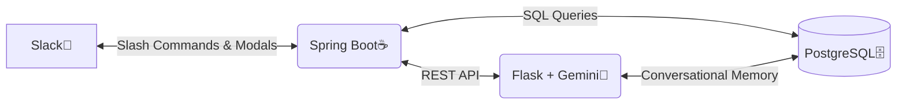

# 🤖 Slack AI Data Bot

An AI-powered Slack application that allows you to chat naturally with your PostgreSQL database. Instead of writing complex SQL queries or dealing with dashboards, ask questions in plain English directly in Slack, and receive rich, interactive data tables and visualizations in seconds.

## ✨ Key Features

*   🗣️ **Natural Language to SQL:** Powered by Google's Gemini AI, it converts plain English questions into optimized PostgreSQL queries.
*   🧠 **Conversation Memory:** Remembers the context of your conversation. You can ask follow-up questions easily (e.g., *"Now filter that by the North region"*).
*   🔍 **Auto Schema Discovery:** Automatically reads and understands your live database schema at runtime. No hardcoded schemas required.
*   🗄️ **Multi-Table Auto-JOINs:** Ask complex questions that span multiple tables, and the bot will automatically figure out the correct `JOIN` logic.
*   📊 **Rich Slack UI & Charts:** Returns data in beautifully formatted, paginated Slack Block Kit tables. Automatically generates and attaches Bar, Line, and Pie charts for trending data.
*   📥 **Instant CSV Exports:** Need to run your own pivot tables? Simply type `/export-csv` to instantly download the results of your last query.
*   ⏰ **Scheduled Reports:** Automate routine data pulls. Type `/schedule-report weekly What were the total sales last week?` and get it delivered every Monday at 9 AM.
*   🚨 **Proactive Anomaly Alerts:** Type `/watch-anomaly 20` to tell the bot to monitor your data hourly and send an alert if metrics swing by more than 20% day-over-day.
*   🔒 **Enterprise Security:** Read-only by design (no `DELETE`, `DROP`, or `UPDATE` allowed). Includes a strict `/allowlist` to ensure only authorized users can interact with the bot.

## 🏗️ Architecture

The project consists of three main components:
1.  **Slack Frontend:** The user interface where queries are asked and data is visualized.
2.  **Spring Boot Backend (Java):** Handles Slack webhooks, Block Kit UI generation, scheduling, access control, and routing.
3.  **Flask + LLM Service (Python):** Interacts with the Gemini API for natural language processing, stores conversational memory via PostgreSQL, and generates matplotlib charts.



## 🚀 Getting Started (Local Development)

### 1. Prerequisites
Ensure you have the following installed:
*   Java (JDK 17+)
*   Python 3.9+
*   PostgreSQL
*   Maven
*   [ngrok](https://ngrok.com/) (for exposing local ports to Slack)

### 2. Environment Setup
You'll need a Google Gemini API key and to configure your Slack app credentials.

**Spring Boot Configuration** (`src/main/resources/application.properties`):
Configure your database properties here. During local development, leave `slack.signing.secret` blank to bypass signature verification.

**Flask Configuration** (`langchain_service/.env`):
Set your `GOOGLE_API_KEY` here.

### 3. Database Initialization
Create your PostgreSQL database (e.g., `analytics`) and run the application once so Spring Boot creates any necessary tables, or manually run your setup scripts.

### 4. Running the Application
A convenient startup script is provided to boot all three services simultaneously. From the root directory:

```bash
bash start-local.sh
```
This script will:
1.  Stop any existing instances of the app.
2.  Start the Python Flask service on port `5001`.
3.  Start the Spring Boot application on port `8080`.
4.  Launch an ngrok tunnel to expose port `8080` to the internet.

### 5. Slack App Configuration
Once the application is running, go to [api.slack.com/apps](https://api.slack.com/apps) and configure your Slash Commands to point to your new ngrok URL (e.g., `https://<your-ngrok-url>.ngrok-free.dev/slack/ask-data`).

## 🛠️ Available Slack Commands

| Command | Description |
| :--- | :--- |
| `/ask-data [question]` | Ask a natural language question about your data. |
| `/ask-data` | Open an interactive modal dialog to query data via dropdowns. |
| `/export-csv` | Export the results of the last query run in the channel as a CSV file. |
| `/clear-memory` | Clear the bot's conversation memory for your current session. |
| `/schedule-report [weekly/daily] [question]` | Schedule an automated data report to be posted to the channel. |
| `/report-now` | Instantly trigger the scheduled report for the current channel. |
| `/watch-anomaly [threshold_pct]` | Register the channel for hourly checks and alerts if data swings beyond the threshold. |
| `/allowlist [add/remove/list] [@user]` | Manage the access control list (Admins only). |
